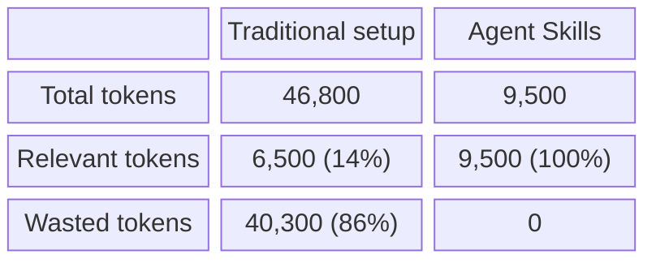
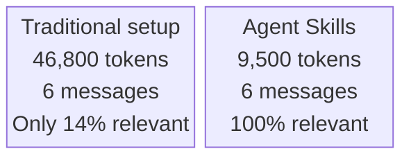

# Campaign #14: AI Agent Skills — Token Efficiency

**Featured post:** [AI Agent Skills: Stop Paying for Tokens You Don't Need](https://bibb.pro/post/ai-agent-skills-token-efficiency/)
**Author:** Aditya Kumar Darak (link in comments)
**Post status:** Live since March 3
**Newsletter send date:** 2026-03-15 (Sunday) — scheduled
**LinkedIn posts:** Day -1, Day 0, Day +2 scheduled

---

## Mailjet configuration

| Field | Value |
|---|---|
| Subject | bibb - X Driven BI | #14 | AI Agent Skills: Stop Paying for Tokens You Don't Need |
| Sender name | bibb \| Oscar Martínez |
| Sender address | contact_bibb@bibb.pro |

---

## Flow

1. Blog post already live at bibb.pro
2. Newsletter #14 features the post and goes out to 13K subscribers
3. LinkedIn posts support the newsletter send and extend reach

---

## LinkedIn posts

### Day -2 — Standalone insight (no newsletter mention needed)

I asked Claude to explain a formula I had just written.

It cost me 7,800 tokens to answer a question that needed zero context.

That is not a model problem. That is an architecture problem.

Most AI setups front-load everything: Lambda patterns, Power Query standards, documentation templates. Loaded every time, for every message, whether you are building a complex model or just asking "what does this step do?"

The result: you pay for tokens that had nothing to do with your question.

Aditya wrote the clearest explanation of the fix I have seen. Link in comments.

#AI #LLM #DataEngineering #PowerBI #AITools

---

### Day -1 — Pre-newsletter

Tomorrow, newsletter #14 goes out to 16,000 Power BI and data subscribers.

The featured post is from Aditya, a contributor I am genuinely excited to introduce to this audience.

The topic: why your AI setup is probably wasting 86% of its context window, and how Agent Skills fix this without switching models or paying more.

If you are not on the list yet, subscribe at bibb.pro (link in comments). If you are, it lands tomorrow.

#Newsletter #PowerBI #AI #DataProfessionals

---

### Day 0 — Newsletter send day

Newsletter #14 is live. 16,000 subscribers across email and LinkedIn.

In it, I introduce Aditya and his post on AI Agent Skills.

The short version: loading all your AI instructions upfront is expensive and inefficient. A clarifying question like "can you explain that?" costs the same as building a full depreciation model, because your instruction file loads regardless.

Skills load context on demand. 86% fewer tokens. Same output.

The longer version, with diagrams and real numbers, is in the post. Link in comments.

If you want future editions, subscribe at bibb.pro (link in comments).

#PowerBI #AI #Newsletter #DataAnalytics #AITools

**Image options:**

---

### Day +2 — Follow-up insight

One number from Aditya's post that I keep coming back to:

A session. Six messages. One piece of work.
Traditional setup: 46,800 tokens. 6,500 relevant.
With Agent Skills: 9,500 tokens. All relevant.

The competitive advantage in AI is not the model. Models are a commodity.
The moat is how you structure the context around the model.

Aditya's post is the clearest practical breakdown of this I have read. Link in comments.

#AI #LLM #PowerBI #DataStrategy #ContextEngineering

**Image option (pull-quote card):**

---

## Notes

- Tag Aditya on Day 0 and Day +2 posts
- LinkedIn: put the article URL in the first comment, not in the post body (better algorithmic reach)
- Day -2 can post any time, independent of newsletter timing
- Track replies and comments on Day 0 and Day +2 as warm signals from the audience
